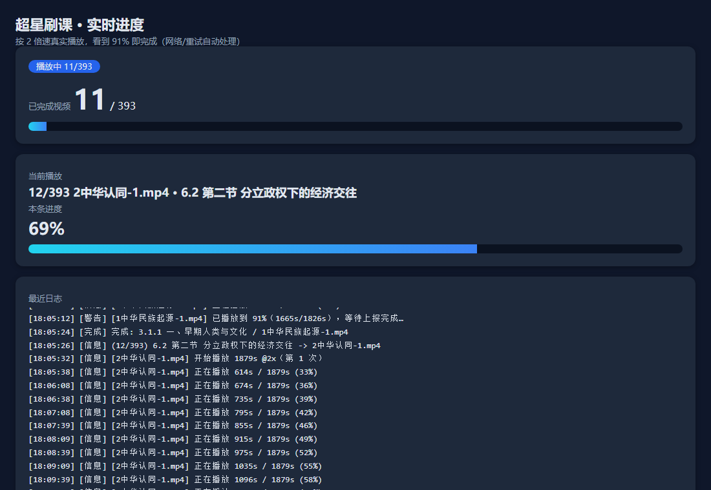

# 🎓 Chaoxing_Fast · 超星学习通任务点自动完成

<p align="center">
  <b>真实播放模式(2倍速 · 看91%即完成) + 接口模式 · 账号密码登录 · 跨平台 · 带实时进度网页</b><br/>
  <i>把「无用网课」交给它，每天省下几小时，解放双手。</i>
</p>

<p align="center">
  
  
  
  
  
  
</p>

> ⚠️ 仅供处理**你自己账号下、确认无学习价值**的课程，请勿用于牟利或代替考试。使用存在被平台风控（验证码拦截、限制学习、封号）的可能，请谨慎、控制频率。

---

## ✨ 特性

- 🖥️ **真实播放模式**：用内置浏览器逐个真实播放视频，播放器自行上报并判定完成 —— 最简单可靠。
- ⚡ **2 倍速播放**：默认加速，节省一半时间（可调）。
- 🎯 **看到 91% 即完成**：适配「观看时长 ≥ 总时长 90%」的完成条件，略留余量防误判（`--ratio` 可调）。
- 🔁 **断连自动重试**：网络偶发 `ERR_CONNECTION_CLOSED` 会自动重试页面加载 / 找播放器，不丢任务。
- 🚀 **并发扫描**：扫描章节用并发请求，507 个知识点从 15 分钟降到约 40 秒。
- 📊 **实时进度网页**：本地打开 `http://127.0.0.1:7788` 即看实时进度、当前视频、本条进度条、日志。
- 🔑 **账号密码登录**：一键登录，Cookie 持久化，无需反复登录；也支持扫码。
- 🧩 **接口模式**：适用于允许「秒完成」的课程；对强制真实计时的课程会自动提示改用真实播放。
- 🌐 **跨平台**：Windows / macOS / Linux，Node 18+ 即可。

## 🖼️ 实时进度 Dashboard 截图



---

## 🚀 快速开始

### 环境要求

| 依赖 | 说明 |
| --- | --- |
| Node.js ≥ 18 | [下载](https://nodejs.org) |
| Playwright + Chromium | 由 `setup` 自动安装 |

### 一键部署

```bash
# Linux / macOS
./setup.sh
# Windows PowerShell
.\setup.ps1
# 或跨平台
node setup.mjs
```

### 首次运行

```bash
# 登录（会弹出浏览器，扫码或账号密码）+ 指定课程
node start.mjs --url "你的课程主页URL"

# 后台挂机 + 实时进度网页
node start.mjs --headless --url "你的课程主页URL"
# 然后浏览器打开 http://127.0.0.1:7788 查看进度
```

`start.mjs` 会自动完成 3 件事：
1. **登录**：无会话时弹出浏览器 → 登录 → Cookie 保存到 `cookies.json`；
2. **课程**：用 `--url`，或读取上次保存的 `config.json`；
3. **真实播放**：2 倍速 + 看 91% 即完成，遇到断连自动重试。

---

## 🧭 常见用法

| 命令 | 说明 |
| --- | --- |
| `node start.mjs --url "<URL>"` | 一键：登录 + 选课程 + 真实播放 |
| `node start.mjs --headless --url "<URL>"` | 后台挂机（不弹浏览器窗口） |
| `node start.mjs --list-courses` | 列出账号下的课程 |
| `node setup.mjs` | 安装依赖 + 下载 Chromium |
| `node src/login.mjs` | 单独登录（浏览器） |
| `node src/chaoxing_watch.mjs --list --url "<URL>"` | 只列出该课程视频，不上报 |

### 常用参数（真实播放）

| 参数 | 说明 | 默认 |
| --- | --- | --- |
| `--url <URL>` | 课程主页 URL（含 courseid/clazzid/cpi） | 必填/记忆 |
| `--rate <n>` | 播放倍速 | `2` |
| `--ratio <n>` | 完成所需时长比例 | `0.91` |
| `--start <n>` | 跳过前 n 个视频（续跑） | `0` |
| `--retry <n>` | 单个视频失败重试次数 | `3` |
| `--scan-concurrency <n>` | 扫描章节点并发 | `6` |
| `--dashboard` / `--port <n>` | 实时进度网页（默认 7788） | 否 |
| `--headless` / `--visible` | 隐藏 / 显示浏览器窗口 | 显示 |

---

## 🧠 工作原理

```
studentcourse 读取章节知识点
        ↓
knowledge/cards(num=0..6) 解析任务卡片    ← 并发扫描提速
        ↓
ananas/status 取 dtoken / duration
        ↓
真实播放器播放 <video>，轮询 currentTime
        ↓
currentTime ≥ ratio×duration  →  播放器上报  →  判定完成
        ↓
下一个视频（自动重试 / 断连重试）
```

- **接口模式**：`ananas/status` → `mooc-ans/multimedia/log/a` 上报进度（`enc` 为超星签名），适用于允许秒完成的课程。

---

## ❓ FAQ

- **提示「需真实播放」**：说明该课程强制真实计时，请用 `start.mjs` 真实播放（默认 2 倍速）。
- **个别视频被跳过**：多为网络偶发断连或转码失败，脚本会重试并提示；可用 `--start` 补跑。
- **登录时出现验证码**：用浏览器登录（`node src/login.mjs`）扫码或账号密码，最稳。
- **浏览器下载失败**：`npx playwright install chromium` 重试。
- **Cookie 失效**：重新运行 `start.mjs`，会再要求登录。

---

## 🤝 Contributing

欢迎 PR！请遵守：
- 保持零描述依赖（核心），仅 `playwright` 为必需运行时依赖。
- 提交前 `node --check` 所有 `.mjs`。
- 不提交 `cookies.json` / `config.json` / `browser-profile/`（已 gitignore）。

---

## 📄 License & Credits

- License: **GPL-3.0**（见 [LICENSE](LICENSE)）
- 接口信息参考自开源项目 [Samueli924/chaoxing](https://github.com/Samueli924/chaoxing)（GPL-3.0，仅作接口研究；本实现为独立实现，未复制其代码）。

## ⭐ 觉得有用就点个 Star！